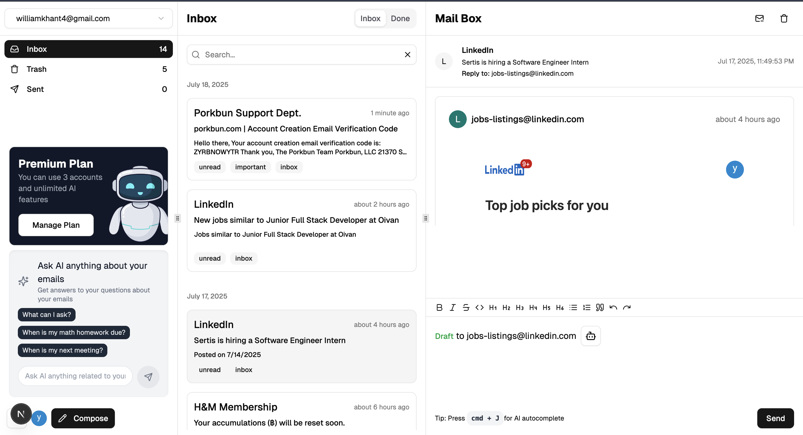

# 📧 Mailquark – AI-Powered Email SaaS Platform

Mailquark is a modern SaaS web application that allows users to **view, manage, and search** emails from multiple linked accounts — enhanced with **AI capabilities** for smarter email workflows.  

Users can:
- Manage emails (delete, mark as read) from all connected accounts in one place.
- Ask an **AI chatbot** questions about their inbox.
- Generate **email templates** and get **autocomplete suggestions**.
- Search emails with **full-text** and **vector-based semantic search**.
- Subscribe to premium AI features via **Stripe**.

---

## 🚀 Features

- **AI-Powered Inbox Assistant**
  - Retrieval-Augmented Generation (RAG) chatbot answers questions about your inbox.
  - Email template generation & AI autocomplete suggestions.
- **Advanced Email Search**
  - Full-text search for fast keyword lookups.
  - Vector search using embeddings for semantic matches.
- **Multi-Account Email Management**
  - View, delete, and mark emails as read across all connected accounts.
- **Subscription Billing**
  - Free plan for basic features.
  - Paid plan via Stripe for AI-enhanced tools.
- **Secure Authentication**
  - Clerk authentication for signup/login and session management.
- **Responsive Modern UI**
  - Built with Shadcn UI components and Tailwind CSS.

---

## 🖼 Screenshot




---

## 🛠 Tech Stack

**Frontend**
- React.js
- Next.js
- Tailwind CSS
- Shadcn UI

**Backend**
- tRPC
- React Query (integrated with tRPC)
- Prisma ORM
- NeonDB (PostgreSQL)

**Integrations & APIs**
- Clerk (authentication)
- Aurinko (email APIs)
- OpenAI API
- Vercel AI SDK
- Orama (full-text & vector search with embeddings)
- Stripe (subscription billing)

**Deployment**
- Vercel

## ⚡ Getting Started

### 1️⃣ Clone the repo
```bash
git clone https://github.com/your-username/mailquark.git
cd mailquark
```
### 2️⃣ Install dependencies
```bash
npm install
```

### 3️⃣ Configure environment variables
DATABASE_URL=YOUE_URL

NEXT_PUBLIC_CLERK_PUBLISHABLE_KEY=YOUR_KEY

CLERK_SECRET_KEY=YOUR_KEY

NEXT_PUBLIC_CLERK_SIGN_IN_URL=/sign-in

NEXT_PUBLIC_CLERK_SIGN_UP_URL=/sign-up

NEXT_PUBLIC_CLERK_SIGN_IN_FALLBACK_REDIRECT_URL=/

NEXT_PUBLIC_CLERK_SIGN_UP_FALLBACK_REDIRECT_URL=/

NEXT_PUBLIC_URL="http://localhost:3000

AURINKO_CLIENT_ID=YOUR_ID

AURINKO_CLIENT_SECRET=YOUR_SECRET

AURINKO_SIGNING_SECRET=YOUR_SECRET

OPENAI_API_KEY=YOUR_KEY

STRIPE_SECRET_KEY=YOUR_KEY
STRIPE_WEBHOOK_SECRET=YOUR_SECRET

### 4️⃣ Run the app
```bash
npm run dev
```
